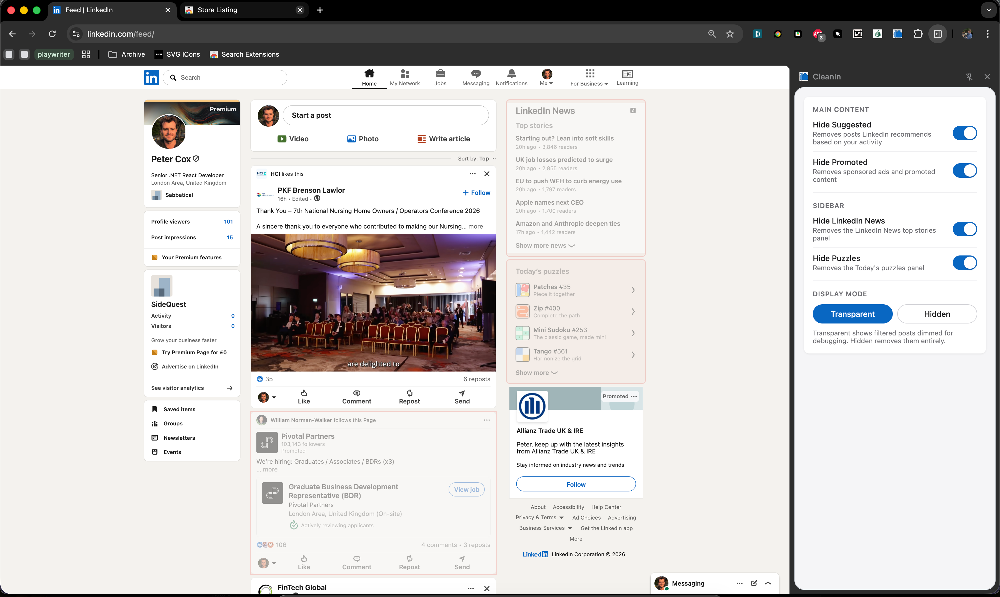

<h2> CleanIn</h2>

CleanIn is a simple Chrome extension that hides unwanted feed content masquerading as real content, such as:

1. Suggested posts
2. Promoted and Promoted by posts
3. Feed or sidebar cards matching custom phrases
4. Sidebar content like News and Puzzles

They are hidden by default, but you can show them as transparent in the side panel if you prefer (dimmed on the page instead of removed). Custom phrase matches are highlighted in yellow when transparent mode is enabled, and removed entirely when hidden mode is enabled.

The source code is available if you'd prefer to build it yourself: [https://github.com/PeterWCox/CleanIn](https://github.com/PeterWCox/CleanIn). I'm open to adding additional functionality—feel free to e-mail me.

## Docs & store releases

- Chrome Web Store form copy and justifications: [docs/chrome-web-store-privacy-answers.md](docs/chrome-web-store-privacy-answers.md) (see also [docs/README.md](docs/README.md)).
- Release TLDR:
  1. Create a `VX.Y.Z` release branch, for example `V1.3.3`, and bump `dist/manifest.json` on that branch.
  2. Push the branch to start Azure. `main` does not trigger builds.
  3. Azure validates that the manifest version matches the branch name, then runs `Build Dist` and publishes `dist.zip` for local QA.
  4. Complete the `QA (Manual)` stage by downloading `dist.zip`, unzipping it, and testing it locally with Load unpacked in Chrome.
  5. Resume the pipeline so `Build Chrome Store ZIP` produces the `cleanin-chrome-store-v*.zip` artifact.
  6. Complete `Upload to Chrome Store (Manual)` after uploading the generated ZIP to the Chrome Developer Store.
  7. Release the uploaded package through the Chrome Web Store, then complete `PROD Smoke Test (Manual)` after testing the live production extension.
  8. After QA, Chrome Store release, and production testing are all complete, Azure opens the PR into `main`.

## Developer instructions

1. Clone this repo.
2. Optional: [snippets/](snippets/) has small reference HTML files for the feed and sidebar shapes the content script looks for.
3. Open `chrome://extensions` in Chrome.
4. Toggle Developer mode on (top right).
5. Click Load unpacked and select the `dist/` folder.
6. Visit [linkedin.com](https://www.linkedin.com/) or [linkedin.com/feed](https://www.linkedin.com/feed/) and open the extension side panel to adjust filters.

Chrome Web Store releases and local unpacked installs both use [dist/](dist/) directly, with the normal `CleanIn` name and production icon. There is no local build step; Azure first zips the folder for QA, then only creates the Chrome Web Store artifact after manual QA is confirmed.

## Caveats
- Only matches the English LinkedIn UI. If your LinkedIn is in French, *toutes mes excuses*.
- LinkedIn could rename "Suggested" to "Things You'll Love" tomorrow and break everything. That's the deal you sign when you scrape a SPA.
- Does not, sadly, hide posts that begin with "Unpopular opinion:".

## License
- MIT. Use it, fork it, ship a better version. Just don't promote it on LinkedIn.
